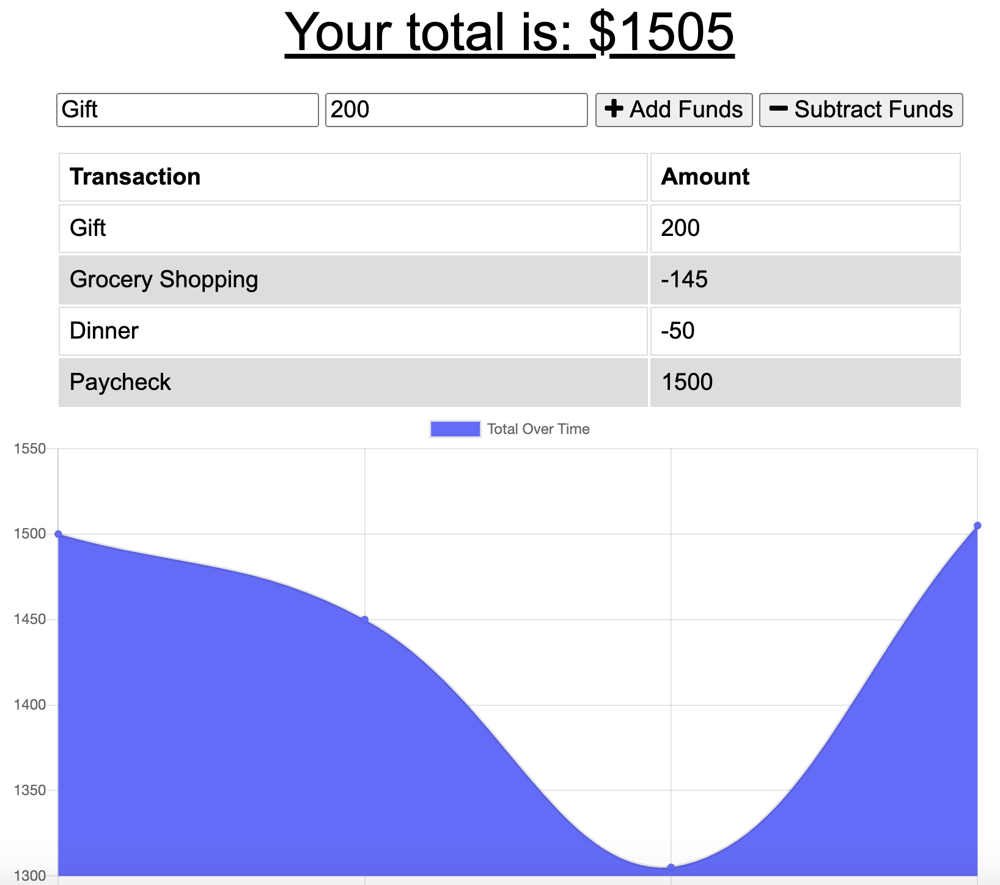

# Online and Offline Budget Tracker

> Although many applications allow users to track their budget deposits and gains, a budget application should contain offline functionality so users can track their finances even without internet access. This Budget Tracker application is a PWA (Progressive Web Application) that allows users to input deposits and expenses even while the app is offline, and it adds their data to the cache regardless.

## Table of Contents

* [Description](#description)
* [Screenshots](#screenshots)
* [License](#license)
* [Questions](#questions)

## Description

The Budget Tracker application allows users to input their purchases and expenses, and the app will arrange them into a chart over time. Users will enter a name and amount for their transaction, and then can click on a button to determine whether they want the app to add or subtract funds. As users keep entering their transactions, the app will keep arranging this data into a table explicitly showing the purchases as well as a graph below it. The user's total budget will also be displayed at the top of the page. The Budget Tracker uses Node.js, Express.js, MongoDB, Mongoose, Morgan, and Compression, and is hosted on Heroku. It is also a Progressive Web Application (PWA), meaning it can be used both online and offline. Even if users do not have internet access, they are able to enter their budget information offline, and the information will be added to the cache when the user comes back online. You can even download the application and save it to your computer or smartphone!

Use the Budget Tracker here at https://quiet-caverns-48288.herokuapp.com/ .

## Screenshots

## License

MIT License

Copyright (c) 2020 Maria Waslick

Permission is hereby granted, free of charge, to any person obtaining a copy
of this software and associated documentation files (the "Software"), to deal
in the Software without restriction, including without limitation the rights
to use, copy, modify, merge, publish, distribute, sublicense, and/or sell
copies of the Software, and to permit persons to whom the Software is
furnished to do so, subject to the following conditions:

The above copyright notice and this permission notice shall be included in all
copies or substantial portions of the Software.

THE SOFTWARE IS PROVIDED "AS IS", WITHOUT WARRANTY OF ANY KIND, EXPRESS OR
IMPLIED, INCLUDING BUT NOT LIMITED TO THE WARRANTIES OF MERCHANTABILITY,
FITNESS FOR A PARTICULAR PURPOSE AND NONINFRINGEMENT. IN NO EVENT SHALL THE
AUTHORS OR COPYRIGHT HOLDERS BE LIABLE FOR ANY CLAIM, DAMAGES OR OTHER
LIABILITY, WHETHER IN AN ACTION OF CONTRACT, TORT OR OTHERWISE, ARISING FROM,
OUT OF OR IN CONNECTION WITH THE SOFTWARE OR THE USE OR OTHER DEALINGS IN THE
SOFTWARE.

## Questions

If you have additional questions, you can contact me through my [GitHub Profile](https://github.com/mwaslick), or e-mail me at mariawaslick@gmail.com.

